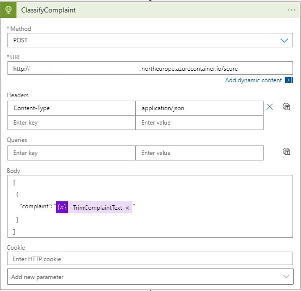
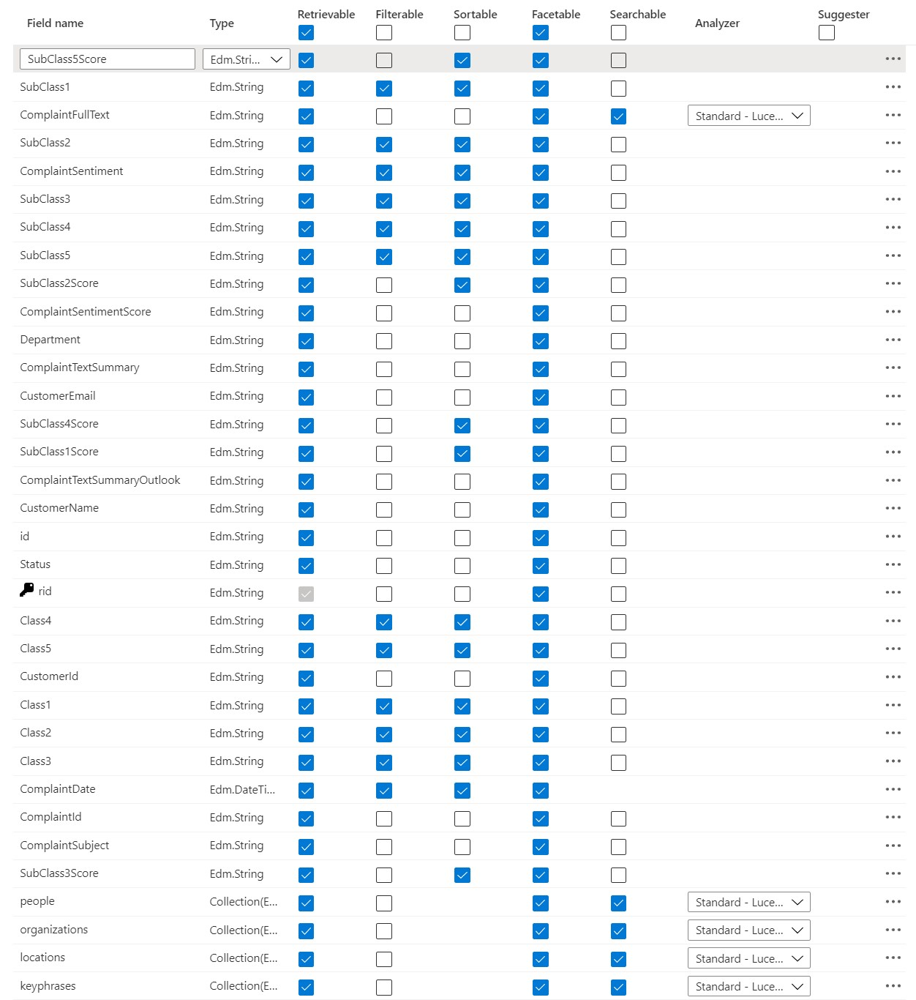
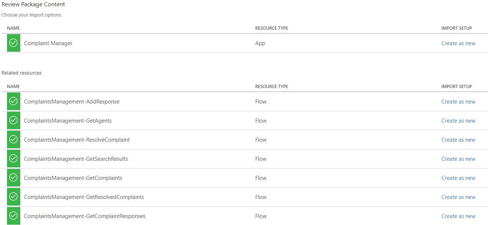
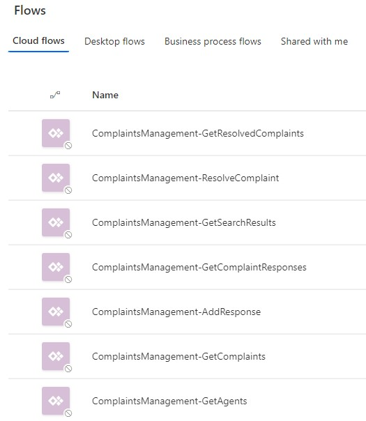
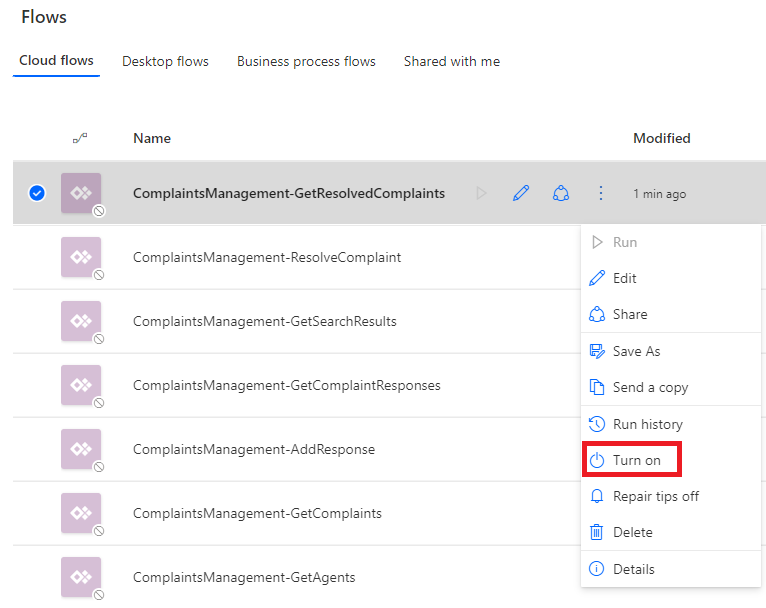
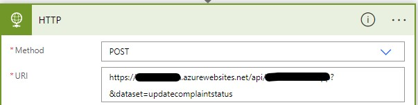
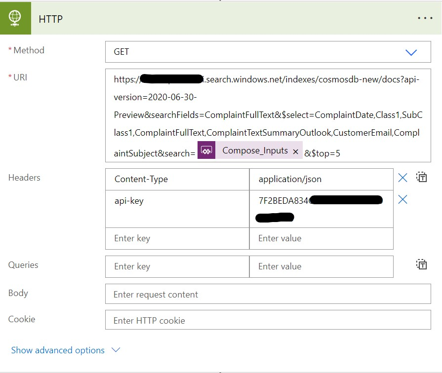

# Deployment Guide
------------------
## Step 1. Download Files
Clone or download this repository and navigate to the project's root directory.

More information on [Cloning a repository](https://docs.github.com/en/repositories/creating-and-managing-repositories/cloning-a-repository)

## Step 2. Upload Sample Dataset

Upload the following files from the `/Deployment/data` folder into the ADLS storage account. The name begins with synapsestrg.
Create under the container `data` a new folder `data`

- fictitious_customer_names.csv
- fictitious_employee_names.csv
- initial_complaints.csv
- initial_responses.csv

Secondly, download the [complaints.csv](https://files.consumerfinance.gov/ccdb/complaints.csv.zip) unzip the folder and upload the file to the same data folder on your ADLS storage account.

## Step 3. Add the Cosmos DB as linked service
In this step you're going to add the Cosmos DB as a linked service in the Synapse Workspace.
1. Launch the Synapse workspace (via Azure portal > Synapse workspace > Workspace web URL) 
2. Click on `Manage - Linked Services - New`
3. Type in the search box "Cosmos" and select the service "Azure Cosmos DB (SQL API)"
4. Click `Continue`
5. Fill in the following data for the linked service

  | Field | Value |
  | ------------- | :-------------: | -----: |
  | Name | CosmosDb |
  | Connect via integration runtime | AutoResolveIntegrationRuntime |
  | Authentication method | Connection String |
  | Account selection method | Enter Manually |
  | Azure Cosmos DB account URI | <Copy the Cosmos DB URI from the Cosmos DB you have created> |
  | Azure Cosmos DB access key | <Copy the Cosmos DB Primary Key from the Cosmos DB you have created> |
  | Database name | customercomplaints |

6. Click `Test Connection`. As a result you should see "Connection Successful"
7. Click `Create`.

## Step 4. Update storage account permisions
In order to perform the necessary actions in Synapse workspace, you will need to grant more access.

1. Go to the Azure Data Lake Storage Account created above
2. Go to the `Access Control (IAM) > + Add > Add role assignment`
3. Search for and select `Storage Blob Data Contributor`. Click `Next` at the bottom of the screen. 
4. Click `+ Select members` and seach for and select your username/email. Click `Select`. 
5. Click `Review + assign` at the top of the page. Then click `Review + assign` at the bottom of the page.    

## Step 5. Upload and run Notebooks
1. Launch the Synapse workspace (via Azure portal > Synapse workspace > Workspace web URL) 
2. Go to `Develop`, click the `+`, and click `Import` to select all Spark notebooks from the repository's `/Deployment/Notebooks` folder
3. For each of the notebooks, select `Attach to > spark1` in the top dropdown
### 00_prepare_data
1. Update `data_lake_account_name` variable to your ADLS in the [00_prepare_data.ipynb](./Deployment/Notebooks/00_prepare_data.ipynb) notebook
2. Update `file_system_name` variable to your container in the [00_prepare_data.ipynb](./Deployment/Notebooks/00_prepare_data.ipynb) notebook

### 01_train_deploy_model
1. Update `data_lake_account_name` variable to your ADLS in the [01_train_deploy_model.ipynb](./Deployment/Notebooks/01_train_deploy_model.ipynb) notebook
2. Update `file_system_name` variable to your container in the [01_train_deploy_model.ipynb](./Deployment/Notebooks/01_train_deploy_model.ipynb) notebook
3. Update `subscription_id` variable to your Azure SubscriptionID in the [01_train_deploy_model.ipynb](./Deployment/Notebooks/01_train_deploy_model.ipynb) notebook
4. Update `resource_group` variable to your ResourceGroup in the [01_train_deploy_model.ipynb](./Deployment/Notebooks/01_train_deploy_model.ipynb) notebook
5. Update `workspace_name` variable to your Azure Machine Learning Workspace in the [01_train_deploy_model.ipynb](./Deployment/Notebooks/01_train_deploy_model.ipynb) notebook
6. Update `workspace_region` variable to your Azure Machine Learning Workspace Region in the [01_train_deploy_model.ipynb](./Deployment/Notebooks/01_train_deploy_model.ipynb) notebook

When all the variables are modified, publish your all imported notebooks so they are saved in your workspace.
Run the following notebooks in order:
  - [00_prepare_data](./Deployment/Notebooks/00_prepare_data.ipynb)
  - [01_train_deploy_model.ipynb](./Deployment/Notebooks/01_train_deploy_model.ipynb)

## Step 6. Configure Logic App
After the runbooks ran successfully an Azure Machine Learning Endpoint has been created.
This enpoint needs to be configured in the Logic App. Secondly, the Office 365 connection needs to be authorized or updated.
Follow the steps below to complete this.
1. Go to the Azure Portal - click on your Azure Machine Learning service and launch the Azure Machine Learning Studio
2. In the studio, click on `Endpoints`
3. Click on the service called `ccm-service-3`
4. In the Details tab, look for the REST endpoint and copy it to your clipboard
5. Go back to the Azure Portal, open the Logic App and select `Logic App Designer`.
6. Click on the component `ClassifyComplaint` and past the endpoint URI you have copied into the URI Field

7. Go to the first component `Connections`,  click `Add New` and configure the E-mailaddress you would like to monitor.
8. Click `Save`.

## Step 7. Test the Logic App
Send an E-mail the Office 365 account that you have configured in the Logic App.  
Make sure that the Subject of the E-mail begins with _Complaint:_  
Paste the text below in the body of the E-mail  

_Over the past 2 weeks, I have been receiving excessive amounts of telephone calls from the company listed in this complaint. The calls occur between XXXX XXXX and XXXX XXXX to my cell and at my job. The company does not have the right to harass me at work and I want this to stop. 
It is extremely distracting to be told 5 times a day that I have a call from this collection agency while at work._ 

Once the E-mail is in the inbox, go to the Azure Portal - click on your Logic App. In the `Run History` of the App, you should see Succeeded.  
To double check, go to the Cosmos DB and verify if the complaint has been added to complaints container.

## Step 8. Configure the Azure Search Service
The Search service is used in the Power App and data needs to be imported before it can be used. Follow the steps below to accomplish this.
1. Go to the Azure Portal and select the Azure Search Service that was deployed.
2. Click on the button `Import Data`
3. We need to use the data from the Cosmos DB. Fill in the following fields:

  | Field | Value |
  | ------------- | :-------------: | -----: |
  | Data Source | Azure Cosmos DB |
  | Data Source Name | <The name of your Cosmos DB> |
  | Connection String | Click on "Choose an existing connection" and select the name of your Cosmos DB |
  | Database | customercomplaints |
  | Collection | complaints | 

4. Click `Next: Add cognitive skills (optional)`
5. Open `Add Enrichments` and fill in the following fields:

  | Field | Value |
  | ------------- | :-------------: | -----: |
  | Skillset name | cosmosdb-skillset |
  | Source data field | ComplaintFullText |
  | Enrichment granularity level | Source field (default) |
  | Text Cognitive Skills | Extract people names |
  | | Extract organization names |
  | | Extract location names |
  | | Extract key phrases |

6. Click `Next: Customize target index` and select all the fields like the screenshot below.

  

7. Click `Next: Create an indexer`
8. Confirm the name of the Indexer and click `Submit`

## Step 9. Configure and Publish the Azure Function
The Function is used in the Complaint Manager Power App to select/insert/update documents in the Cosmos DB.  
Go to the Azure Portal and note down the name of your Function App.

Follow the steps described in [Quickstart: Create a function in Azure with Python using Visual Studio Code](https://docs.microsoft.com/en-us/azure/azure-functions/create-first-function-vs-code-python)
Once the local project is created:
  - Replace the code of the __init__.py file with the code in the file [Deployment/Function/__init__.py](./Deployment/Function/__init__.py)
    - In the code update the url and the key variable. The url should be the URI of your Cosmos DB. The Key is the Primary Key of your Cosmos DB.
  - Replace the code of the `requirements.txt` file with the code in the file [Deployment/Function/requirements.txt](./Deployment/Function/requirements.txt)

Once all the files are updated, save and Publish the local project to Azure.

After the publication, go to the Function App - Functions, and click on the `Function`.  
Click the button `Get Function Url` and copy and save the URL. You'll need it in the next step.

## Step 10. Deploy and configure the Complaint Manager Power App
1. Go to https://make.preview.powerapps.com/
2. In the right upper corner, make sure you select the correct environment where you want to deploy the Power App.
3. Click on `Apps - Import Canvas App`
4. Click upload and select the [Deployment/PowerApp/CCMPowerApp.zip](./Deployment/PowerApp/CCMPowerApp.zip) Zipfile.
5. Review the package content. You should see the details as the screenshot below

  

6. Under the `Review Package Content`, click on the little wrench next to the Application Name `Complaint Manager`, to change the name of the Application. Make sure the name is unique for the environemnt.
7. Click Import and wait until you see the message `All package resources were successfully imported.`
8. Click on `Flows`. You will notice that all the flows are disabled. 

9. You need to turn them on before you can use them. Hover over each of the flows, select the button `More Commands` and click `Turn on`.

10. For each flow (except ComplaintsManagement-GetSearchResults, see point 11), you need to change the HTTP component so that the URI points to your Azure Function App. Edit each flow, open the HTTP component and past the Azure Function Url before the first &.
Your URI should look similar like the screenshot below.

11. For the ComplaintsManagement-GetSearchResults flow, change the URI with your Azure Search Service URI. Replace the api-key with the primary admin key of your Search Service.
Your HTTP component should look similar like the screenshot below.

12. After the modification, click the "Test" button in the upper right corner to test the flow. If all went well, you should receive "Your flow ran successfully".
13. Once the flows are modified, you should open the Power App and all should work like a charm.